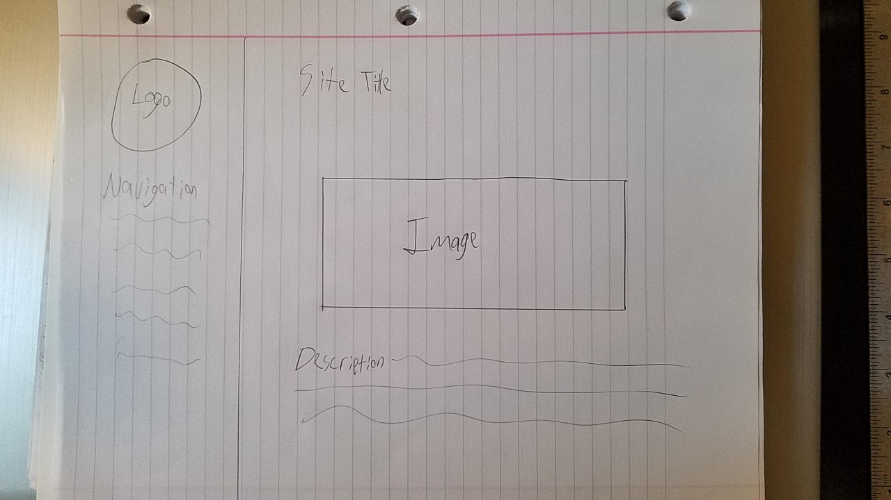

13. Padding is the amount of space between the inner content of the element and the element itself. Margin is the space between a element and other elements. Borders create a shape around an element.

14. 

15. This assignment took me awhile. There was a lot to learn but a lot of useful stuff! I started with a different design but decided to use that one for assignment 12 when I had a better grasp on the material. I ran into a problem that took me awhile to figure out. In the end I forgot a ; in the .css file. Small mistake that ruined half the page!
